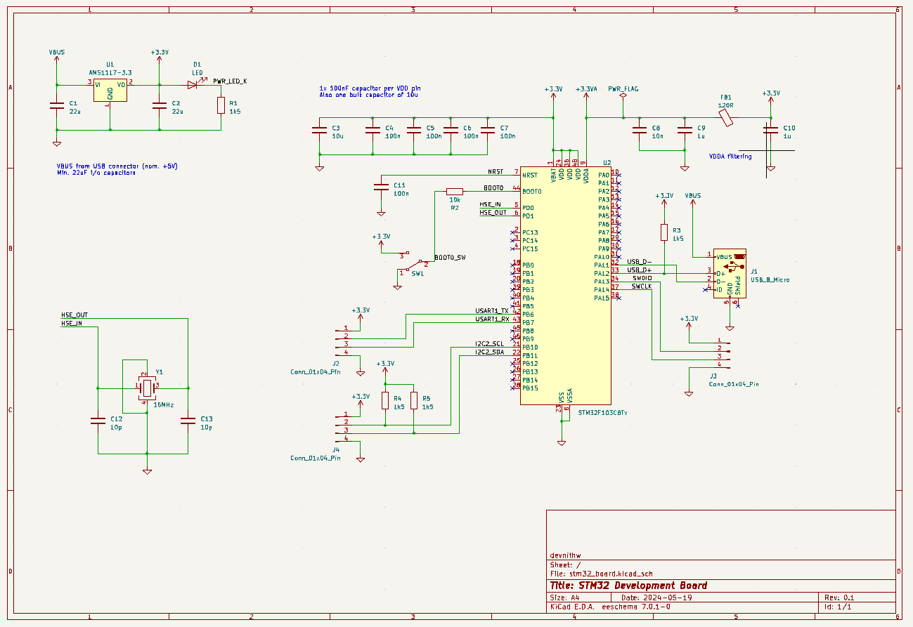
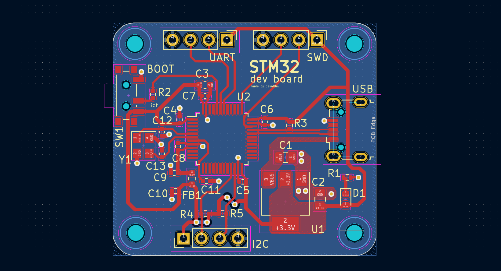
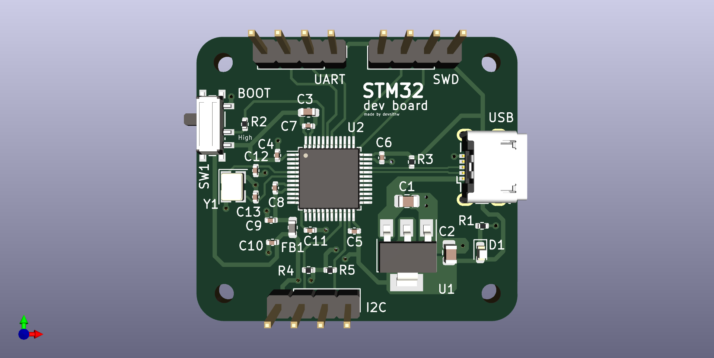

# STM32 Development board

This project contains KiCAD project files for a custom STM32 development board PCB which uses the STM32F103C8Tx microcontroller.

## Schematic design
The PCB schematic file for development board is contained in the file `stm32_board.kicad_sch`. The following is a screenshot of the schematic. 

The development board uses the `STM32F103C8Tx` microcontroller. USB interface is used for both power supply and serial communication. The power fdrom the USB interface is regulated to +3.3V using the regulator circuit. An High Speed External clock is used for 16 MHz operation. The board includes pin header ports for UART and I2C communication also.

## PCB design
The PCB layout file for the circuit is contained in `stm32_board.kicad_pcb` file. Below is the screenshot of the final PCB layout after routing. I have included mounting holes for the board to be mounted onto a enclosure. The footprints for most of the components have been used from the KiCAD library itself. 3D view for the USB port was downloaded from the manufaturer's website as a step file. It is included in the file `629105150521 (rev1).stp`. I have added male headers for the UART, Serial Wire Debug and I2C communication ports. These can be configured using the STM32 Cube IDE software. 

Shown below is the 3D view of the routed and finalized PCB.

This project was done following the Udemy course by Philip Salmony. [Reference](https://www.udemy.com/course/learn-kicad-v6-and-stm32-hardware-design/)

## Technologies Used
- KiCAD V7
- STM32